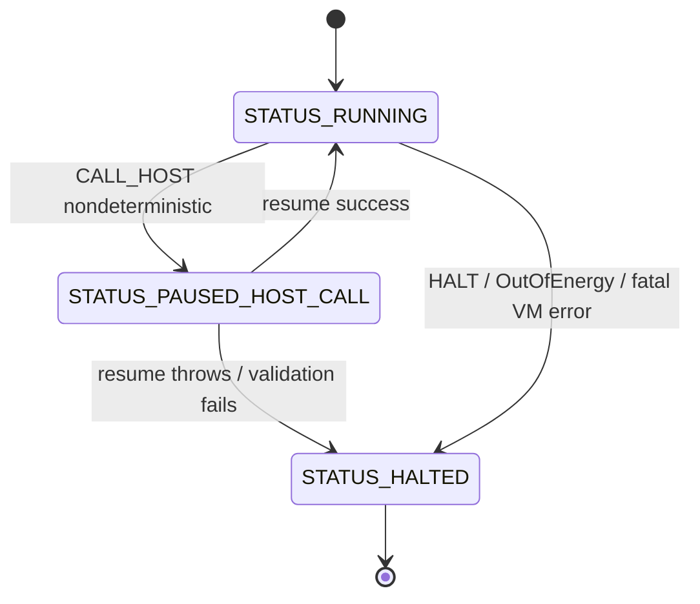

# RFC: CVM Async Host-Call Lifecycle

**Status:** IMPLEMENTED in alpha3d1  
**Target:** `v2.2.0-alpha3d1`  
**Scope:** Durable single pending host call lifecycle  
**Depends on:** `v2.2.0-alpha3c2`, `HOST_ABI_VERSION = "2.2.0-alpha3b2"`

This RFC defines the durable lifecycle for a single pending asynchronous host call in the Cognitive VM. It is intentionally limited to the runtime state machine, snapshot/replay contracts, and resume invariants. It does not introduce new language syntax or multiple concurrent pending calls.

---

## 1. Goals & Non-Goals

### Goals

- Define a durable **single pending host call** lifecycle for CVM.
- Preserve deterministic replay across snapshot/restore boundaries.
- Specify a content-addressed, replay-safe `call_id`.
- Define exact serialization rules for pending host-call arguments.
- Separate replay identity from observability side effects.
- Define security gates for cross-process resume.
- Prevent reentrancy, double resume, and snapshot/resume race conditions.

### Non-Goals

The following are explicitly out of scope for Alpha.3-D1:

- `YIELD` / `AWAIT` language syntax.
- Actor scheduler integration.
- Streaming or partial host-call results.
- Timeout and cancellation implementation.
- Multiple concurrent pending host calls.
- Dynamic opcode plugins.
- `FALLBACK_HOST` opcode.
- Hot code migration.

---

## 2. Envelope Schema v1

A pending asynchronous host call is represented as a JSON-safe envelope stored in `VMState.pending_host_call`.

```json
{
  "pending_schema_version": "1",
  "status": "STATUS_PAUSED_HOST_CALL",
  "call_id": "hc-...",
  "symbol": "SYS_LLM_EVAL",
  "args": [],
  "argc": 2,
  "ip_after_call": 42,
  "program_hash": "sha256:...",
  "transition_hash_at_call": "sha256:...",
  "frame_depth_at_call": 3,
  "agent_id": "default_agent",
  "required_capabilities": ["llm.eval"],
  "host_abi_version": "2.2.0-alpha3b2",
  "created_at_event_id": "evt-...",
  "determinism_class": "nondeterministic"
}
```

### Field requirements

| Field | Required | Meaning |
|---|---:|---|
| `pending_schema_version` | yes | Envelope version. Must be `"1"` for Alpha.3-D1. |
| `status` | yes | Must be `"STATUS_PAUSED_HOST_CALL"`. |
| `call_id` | yes | Deterministic content-addressed host-call identity. |
| `symbol` | yes | Host symbol invoked by `CALL_HOST`. |
| `args` | yes | JSON-safe encoded arguments via `encode_vm_value()`. |
| `argc` | yes | Original arity consumed from operand stack. |
| `ip_after_call` | yes | Instruction pointer after `CALL_HOST` pre-increment. |
| `program_hash` | yes | Current `BytecodeProgram.program_hash`. |
| `transition_hash_at_call` | yes | VM transition hash at deterministic call-id capture point. |
| `frame_depth_at_call` | yes | `len(vm.state.call_stack)` at call time. |
| `agent_id` | yes | Effective agent identity used for capability evaluation. |
| `required_capabilities` | yes | Exact capabilities required by the host symbol. |
| `host_abi_version` | yes | Must match `HOST_ABI_VERSION`. |
| `created_at_event_id` | yes | Last committed event id before the host call. |
| `determinism_class` | yes | One of `deterministic_pure`, `deterministic_side_effect`, `nondeterministic`. |

---

## 3. Deterministic `call_id` Generation

`call_id` must be deterministic. Random UUIDs are forbidden in the durable execution layer.

```python
def compute_call_id(program_hash, ip, transition_hash, event_id, frame_depth):
    seed = f"{program_hash}|{ip}|{transition_hash}|{event_id}|{frame_depth}"
    return "hc-" + hashlib.sha256(seed.encode()).hexdigest()[:16]
```

### Capture point

The seed components are captured at a precise point in `CALL_HOST` execution:

- `ip`: IP of the `CALL_HOST` instruction **before** pre-increment is semantically completed.
- `transition_hash`: after popping host-call args, before writing `pending_host_call`.
- `event_id`: last committed host event id before the host call.
- `frame_depth`: `len(vm.state.call_stack)` at the moment of `CALL_HOST`.
- `program_hash`: `vm.program.program_hash`.

### `transition_hash` after resume

`transition_hash_at_call` is identity metadata for `call_id` generation and resume validation. After a successful `resume_host_call()`, the VM MUST recompute `state.transition_hash` after the response value has been pushed to the operand stack and `pending_host_call` has been cleared. The next checkpoint MUST use this updated hash, not `transition_hash_at_call`.

### Recursion invariant

`frame_depth` is mandatory. Without it, recursive calls at the same bytecode IP with equivalent transition material can collide.

---

## 4. Argument Serialization Contract

`pending_host_call.args` must be serialized through the same codec as the VM operand stack and locals.

```python
encoded_args = encode_vm_value(args)
restored_args = decode_vm_value(encoded_args)
```

### FunctionObject validation

If an argument contains a `FunctionObject`, validation is recursive and fail-closed.

```python
def validate_function_object(obj, current_program_hash):
    if obj.program_hash != current_program_hash:
        raise VMResumeSyncError("FunctionObject program_hash mismatch")
    for captured in obj.closure.values():
        if isinstance(captured, FunctionObject):
            validate_function_object(captured, current_program_hash)
```

Validation applies to:

- Direct `FunctionObject` args.
- `FunctionObject` values nested in lists or dicts.
- `FunctionObject` values captured in closures.

Any mismatch or missing `program_hash` is a resume failure.

---

## 5. Determinism Classification Registry

Host symbols are classified by replay behavior, not by whether they return data.

```python
DETERMINISTIC_PURE_HOST_SYMBOLS = {
    "len", "str", "int", "float", "bool", "abs", "range"
}

DETERMINISTIC_SIDE_EFFECT_HOST_SYMBOLS = {
    "print"
}

NONDETERMINISTIC_HOST_SYMBOLS = {
    "SYS_MEMORY_READ",
    "SYS_MEMORY_WRITE",
    "SYS_AFFECTIVE_READ",
    "SYS_AFFECTIVE_EVENT",
    "SYS_LLM_EVAL",
    "SYS_POLICY_CHECK"
}
```

### Category semantics

| Class | Replay behavior | History stream |
|---|---|---|
| `deterministic_pure` | Recompute result | none |
| `deterministic_side_effect` | Deterministic result, replay side effect by event sequence | `side_effect_history` |
| `nondeterministic` | Lookup result by `call_id` | `execution_history` |

`print` is intentionally a deterministic side effect: its return value is deterministic (`None`), but its output must be tracked for observability.

---

## 6. Dual History Architecture

Alpha.3-D separates replay identity from observability.

### `execution_history`

Used for nondeterministic host-call resolution.

```json
{
  "type": "host_call_resolved",
  "call_id": "hc-...",
  "symbol": "SYS_LLM_EVAL",
  "result": {"text": "..."},
  "agent_id": "default_agent"
}
```

Lookup is by unique `call_id`.

### `side_effect_history`

Used for deterministic side effects and structural observability, such as:

- `print` output.
- `context_entered` / `context_exited` events.
- Other deterministic side-effect observations.

Lookup is by event-id sequence, not by host-call `call_id`.

`print` must not enter the nondeterministic lookup table.

---

## 7. VMStatus State Machine

`pending_host_call` is distinct from `halted`. Observability and tests must not infer pause state from `halted` alone.

```python
def status(vm) -> str:
    if vm.state.pending_host_call:
        return "STATUS_PAUSED_HOST_CALL"
    if vm.halted:
        return "STATUS_HALTED"
    return "STATUS_RUNNING"
```

### State diagram



ASCII equivalent:

```text
RUNNING --CALL_HOST nondeterministic--> PAUSED_HOST_CALL
PAUSED_HOST_CALL --resume success--> RUNNING
PAUSED_HOST_CALL --resume throws--> HALTED (error preserved)
RUNNING --HALT/OutOfEnergy--> HALTED
```

---

## 8. Resume Invariants

Resume is an atomic state transition.

### Required invariants

- `call_id` supplied by host must equal `pending_host_call.call_id`.
- Double resume is forbidden.
- IP must not be incremented by `resume()`: `CALL_HOST` already pre-incremented IP.
- Result is pushed to the operand stack exactly once.
- `pending_host_call` is cleared exactly once.
- If resume fails, VM transitions to `STATUS_HALTED` and preserves the error.

### Double resume failure

Double resume raises `VMResumeSyncError` with code `DOUBLE_RESUME_FORBIDDEN`.

```python
raise VMResumeSyncError(
    code="DOUBLE_RESUME_FORBIDDEN",
    message=f"Host call {call_id} already resumed"
)
```

`VMHostError` is not used for double resume because this is a resume protocol violation, not a host-call execution error.

---

## 9. Security Gates at Resume

Resume must be fail-closed.

### Agent identity trust gate

Existing Alpha.3-B behavior remains authoritative:

- `vm.state.agent_id` has priority over host default identity.
- If snapshot `agent_id` differs from host `current_agent_id`, restore/resume is blocked unless the host explicitly opts in via `trust_snapshot_agent_id = True`.

### Exact capability match

Resume uses `required_capabilities`, not a mutable free-form capability snapshot.

```python
if set(host.capabilities) != set(pending.required_capabilities):
    raise VMResumeSyncError("Capability set mismatch at resume")
```

A superset is not accepted. Exact match is required to prevent privilege drift and downgrade/upgrade ambiguity across process boundaries.

`trust_snapshot_agent_id = True` does not bypass the capability check.

### Host ABI match

```python
if pending.host_abi_version != HOST_ABI_VERSION:
    raise VMResumeSyncError("HOST_ABI_VERSION mismatch")
```

### Recursive FunctionObject validation

Any `FunctionObject` in pending args must match the current `program_hash` recursively through closures, as defined in Section 4.

---

## 10. Bridge Lifecycle Lock

Snapshot and resume must not race. Alpha.3-D uses a two-phase snapshot pattern to avoid coarse-lock deadlocks.

```python
def make_vm_snapshot(self):
    # Phase 1: copy-on-read under lock; fast, no serialization.
    with self._bridge_lock:
        state_copy = self._copy_vm_state()

    # Phase 2: serialize outside lock; slow but deadlock-safe.
    return self._serialize_state(state_copy)
```

### Lock covers

- `make_vm_snapshot()` phase 1 copy-on-read.
- `restore_vm_from_checkpoint()` critical state replacement.
- `resume_host_call()` phase 1 validation and state mutation.

### Lock does not cover

- Host-call dispatch.
- Async handler execution.
- Long-running host work.
- Serialization phase.

Holding the bridge lock during host dispatch is forbidden because async handlers may re-enter bridge APIs and deadlock.

---

## 11. Reentrancy Guard

Alpha.3-D uses a two-level reentrancy guard.

### VM-level guard

A VM may have at most one pending **nondeterministic** host call in D1. The VM instruction loop MUST NOT continue while `pending_host_call` is present. Bridge-level deterministic helper dispatch may still be used by the host while the VM is paused, provided it does not create a second pending call.

```python
def check_reentrancy(symbol):
    if vm.status() != "STATUS_PAUSED_HOST_CALL":
        return
    if symbol in DETERMINISTIC_PURE_HOST_SYMBOLS:
        return
    if symbol in DETERMINISTIC_SIDE_EFFECT_HOST_SYMBOLS:
        return
    raise VMError("Nested nondeterministic host call during pause")
```

This preserves the single-pending invariant without regressing synchronous deterministic helpers such as `len()` or `print()`.

### Bridge-level guard

Existing Alpha.3-B nested host-call protection remains active.

```python
if bridge._nested_host_call_depth > 0:
    raise VMHostError(code="NESTED_HOST_CALL", ...)
```

The VM-level guard protects state-machine invariants; the bridge-level guard protects host-dispatch reentrancy.

---

## 12. Replay Contract

### Deterministic pure

- Recompute result from same args.
- Do not read or write `execution_history`.
- Apply fixed gas accounting as in Section 13.

### Deterministic side effect

- Result is deterministic.
- Side effect is replayed from `side_effect_history` by event-id sequence.
- Does not participate in nondeterministic `call_id` lookup.

### Nondeterministic

- Lookup in `execution_history` by `call_id`.
- Found 0 events: `VMResumeSyncError`.
- Found more than 1 event: `VMResumeSyncError`.
- Found exactly 1 event: use recorded result.

```python
matches = [e for e in execution_history if e.get("call_id") == call_id]
if len(matches) != 1:
    raise VMResumeSyncError("host_call_resolved event cardinality violation")
result = matches[0]["result"]
```

### Unique call_id invariant

`call_id` must be globally unique within the replay history of a VM execution timeline.

---

## 13. Gas Accounting for Deterministic Replay

Replay must not depend on Python wall-clock time or implementation-specific host performance.

For `DETERMINISTIC_PURE_HOST_SYMBOLS`:

- Gas is charged using fixed VM metadata for the instruction during live execution and replay/recompute.
- Gas does not depend on the actual runtime duration of Python builtins.

For `NONDETERMINISTIC_HOST_SYMBOLS`:

- Live execution charges fixed CALL_HOST gas before the VM enters `STATUS_PAUSED_HOST_CALL`.
- Replay from `execution_history` by `call_id` MUST still observe the same fixed gas charge; reading a recorded result is not a gas-free bypass.
- A loop containing a nondeterministic host call MUST reach `OutOfEnergy` at the same logical iteration count in live and replay modes.

For `DETERMINISTIC_SIDE_EFFECT_HOST_SYMBOLS`:

- Gas is charged using fixed VM metadata for the instruction.
- The side effect is replayed from `side_effect_history` by event-id sequence; the deterministic return value remains unchanged.

---

## 14. Reserved States for Future

The following states are reserved but not implemented in D1:

```python
STATUS_CANCELLED_HOST_CALL = "STATUS_CANCELLED_HOST_CALL"
STATUS_HOST_CALL_TIMEOUT = "STATUS_HOST_CALL_TIMEOUT"
```

Future scope:

- Cancellation propagation.
- Timeout enforcement.
- Multiple concurrent pending calls.
- Promise multiplexing.
- Streaming host-call results.

D1 must reject or ignore these states if encountered in snapshots unless a future schema version explicitly enables them.

---

## 15. HOST_ABI_VERSION Policy

`HOST_ABI_VERSION` is a single source of truth in the bridge layer.

```python
HOST_ABI_VERSION = "2.2.0-alpha3b2"
```

### D1/D2 policy

- D1 does not change `HOST_ABI_VERSION` because it changes the VM state machine, not the host-symbol ABI.
- D2 also keeps the same ABI unless it introduces new host symbols.
- ABI must be bumped only when new symbols or incompatible host-call contracts are added, such as `SYS_PROMISE_CREATE`.

Snapshot and pending host-call envelopes must fail-closed if their `host_abi_version` does not match the current bridge ABI.

---

## Acceptance Checklist

This RFC is implementation-ready only if all items are satisfied.

| # | Criterion | Status |
|---|---|---|
| 1 | 15 sections present | yes |
| 2 | `pending_schema_version` in envelope | yes |
| 3 | `frame_depth` in `call_id` formula | yes |
| 4 | Seed capture point specified | yes |
| 5 | Recursive FunctionObject validation | yes |
| 6 | Three determinism classes | yes |
| 7 | Dual history streams | yes |
| 8 | `print` in deterministic side-effect class | yes |
| 9 | Explicit HALTED transition on failed resume | yes |
| 10 | Two-phase snapshot pattern | yes |
| 11 | Exact capability match | yes |
| 12 | `required_capabilities` terminology | yes |
| 13 | Double resume uses `VMResumeSyncError` | yes |
| 14 | Two-level reentrancy guard | yes |
| 15 | Unique `call_id` replay invariant | yes |
| 16 | Fixed gas accounting for deterministic replay | yes |
| 17 | `HOST_ABI_VERSION = "2.2.0-alpha3b2"` | yes |
| 18 | Reserved states documented | yes |
| 19 | Non-goals explicit | yes |
| 20 | State machine diagram present | yes |

---

## Implementation Gate

Alpha.3-D1 may start only after this RFC is merged.

The first implementation commit should be:

```text
feat(vm): add VMStatus state machine and deterministic host-call identity
```

Implementation must follow this RFC exactly. Architectural deviations require an RFC amendment before code changes.

---

# Amendment A: Alpha.3-D2 Bridge-Side Promise Resolution

**Status:** RFC amendment proposed for Alpha.3-D2  
**Target:** `v2.2.0-alpha3d2`  
**Scope:** Bridge-side promise lifecycle, history-bound promise resolution, and actor wake-up hooks  
**Depends on:** Alpha.3-D1 durable single pending host-call lifecycle

This amendment extends the Alpha.3-D1 async host-call lifecycle with a bridge-owned promise layer. It does **not** replace the D1 single pending host-call semantics; instead, it defines how the bridge represents the external work that eventually resolves or rejects a pending host call.

D2 is an RFC-driven design step. Runtime implementation must not start until this amendment is reviewed and accepted.

## A1. Goals & Non-Goals

### Goals

- Define a bridge-side `PromiseRecord` lifecycle for host calls that cannot complete synchronously.
- Bind each promise to the D1 `call_id` and pending host-call envelope.
- Define resolution and rejection events that are durable, replayable, and included in the execution-history hash chain.
- Specify actor wake-up hooks for suspended CVM actors.
- Preserve D1 invariants: single VM pending call, deterministic `call_id`, exact security checks, no language-level `YIELD` / `AWAIT`.

### Non-Goals

The following are out of scope for Alpha.3-D2:

- Multiple concurrent pending calls in one CVM instance.
- `YIELD` / `AWAIT` syntax.
- Timeout enforcement.
- Cancellation propagation.
- Streaming or partial results.
- Dynamic opcode plugins.
- `HabitStmt` compilation.
- `FALLBACK_HOST` execution substrate.

## A2. Promise Lifecycle States

A bridge-side promise has exactly one of these states:

```text
PENDING  -> RESOLVED
PENDING  -> REJECTED
PENDING  -> TIMEOUT   (reserved, not implemented in D2)
PENDING  -> CANCELLED (reserved, not implemented in D2)
```

D2 implements only `PENDING`, `RESOLVED`, and `REJECTED`.

### State invariants

- A promise is created in `PENDING` state.
- A `PENDING` promise may transition exactly once to `RESOLVED` or `REJECTED`.
- A terminal promise may not transition again.
- Duplicate `resolve()` or `reject()` attempts for the same `call_id` must raise `VMResumeSyncError` with code `PROMISE_ALREADY_COMPLETED`.
- A promise must be keyed by the D1 deterministic `call_id`; no UUID-based identity is allowed.

## A3. Promise Record Schema

Bridge-side promise state is represented by a JSON-safe record:

```json
{
  "promise_schema_version": "1",
  "call_id": "hc-...",
  "symbol": "SYS_LLM_EVAL",
  "agent_id": "default_agent",
  "required_capabilities": ["llm.eval"],
  "host_abi_version": "2.2.0-alpha3b2",
  "status": "PENDING",
  "created_at_event_id": "evt-...",
  "resolved_at_event_id": null,
  "result": null,
  "error": null
}
```

### Field requirements

| Field | Required | Meaning |
|---|---:|---|
| `promise_schema_version` | yes | Must be `"1"` for D2. |
| `call_id` | yes | D1 deterministic pending host-call id. |
| `symbol` | yes | Host symbol being resolved. |
| `agent_id` | yes | Effective agent identity from the D1 envelope. |
| `required_capabilities` | yes | Exact capability set captured at call time. |
| `host_abi_version` | yes | Must equal `HOST_ABI_VERSION`. |
| `status` | yes | `PENDING`, `RESOLVED`, or `REJECTED`. |
| `created_at_event_id` | yes | Last committed event before promise creation. |
| `resolved_at_event_id` | terminal | Event id for resolution or rejection. |
| `result` | terminal success | JSON-safe resolved value via `encode_vm_value()`. |
| `error` | terminal failure | JSON-safe error object. |

## A4. Bridge-Side Promise API

The bridge exposes a minimal promise API:

```python
promise = bridge.create_promise(call_id)
promise.resolve(value)
promise.reject(error)
promise.cancel()  # reserved; must raise NotImplementedError in D2
```

### `create_promise(call_id)`

- Requires an existing D1 `pending_host_call` envelope with the same `call_id`.
- Fails closed if no VM is currently paused for `call_id`.
- Fails closed if a promise with the same `call_id` already exists.
- Creates a `PromiseRecord` in `PENDING` state.
- Does not resume the VM.

### `resolve(value)`

- Encodes `value` via `encode_vm_value()`.
- Writes a `promise_resolved` event to `execution_history`.
- Updates the promise state to `RESOLVED`.
- Notifies the actor runtime, if present.
- Does not call `vm.resume_host_call()` directly unless the bridge is configured for immediate local resume.

### `reject(error)`

- Encodes the error as a JSON-safe object.
- Writes a `promise_rejected` event to `execution_history`.
- Updates the promise state to `REJECTED`.
- Notifies the actor runtime, if present.
- The eventual VM resume pushes the error object onto the VM operand stack.

## A5. Actor Runtime Integration

D2 defines hooks but does not mandate a specific scheduler implementation:

```python
actor_runtime.suspend_on_promise(actor_id, call_id)
actor_runtime.wake_on_resolve(actor_id, call_id)
actor_runtime.wake_on_reject(actor_id, call_id)
```

### Integration contract

- When a CVM actor enters `STATUS_PAUSED_HOST_CALL`, the bridge may call `suspend_on_promise(actor_id, call_id)`.
- When a promise resolves, the bridge calls `wake_on_resolve(actor_id, call_id)`.
- When a promise rejects, the bridge calls `wake_on_reject(actor_id, call_id)`.
- Wake-up notifications are delivered through the actor mailbox or equivalent host mechanism.
- If no actor runtime is configured, the promise record remains durable and may be resumed explicitly by host code.

## A6. History Chain Integrity

Promise state transitions are replay-significant and must be recorded in `execution_history`.

### Required event shapes

```json
{
  "type": "promise_created",
  "call_id": "hc-...",
  "symbol": "SYS_LLM_EVAL",
  "agent_id": "default_agent",
  "event_id": "evt-..."
}
```

```json
{
  "type": "promise_resolved",
  "call_id": "hc-...",
  "symbol": "SYS_LLM_EVAL",
  "result": {},
  "event_id": "evt-..."
}
```

```json
{
  "type": "promise_rejected",
  "call_id": "hc-...",
  "symbol": "SYS_LLM_EVAL",
  "error": {"type": "VMHostError", "code": "...", "message": "...", "symbol": "SYS_LLM_EVAL"},
  "event_id": "evt-..."
}
```

### Hash-chain rule

The execution-history hash chain must include `promise_created`, `promise_resolved`, and `promise_rejected` events. A replay that observes a different promise transition sequence must fail closed with `VMResumeSyncError`.

## A7. Error Propagation

Promise rejection propagates as a JSON-safe error object.

### Error object schema

```json
{
  "type": "VMHostError",
  "code": "PROMISE_REJECTED",
  "message": "...",
  "symbol": "SYS_LLM_EVAL",
  "call_id": "hc-..."
}
```

Rules:

- Raw Python exceptions must never be pushed to the VM stack.
- Tracebacks must not be serialized into snapshots or golden replay fixtures.
- Host-only diagnostic details may be stored in host logs, not in VM state.
- Guest code receives a JSON-safe error object and may branch on `error.code`.

## A8. Multiple Promises Scope Decision

D2 keeps the D1 **single pending call per VM** invariant.

### D2 decision

- `VMState.pending_host_call` remains a single envelope, not an array.
- The bridge may hold many `PromiseRecord` instances globally, but each CVM instance may have at most one pending promise-bound host call.
- Multiple concurrent pending calls from the same CVM are reserved for D3.

### Reserved D3 shape

A future D3 design may replace `pending_host_call` with:

```json
{
  "pending_host_calls": [
    {"call_id": "hc-..."}
  ]
}
```

This is not implemented in D2.

## A9. Security Gates at Resolve

Promise resolution must pass the same zero-trust gates as D1 resume.

Required checks:

1. `call_id` must match an existing `PENDING` promise.
2. `host_abi_version` must equal `HOST_ABI_VERSION`.
3. Resolver `agent_id` must match the promise `agent_id`, unless an explicit trusted bridge policy authorizes delegated resolution.
4. Resolver capabilities must exactly match the promise `required_capabilities`.
5. The associated VM pending envelope must still be present and match `call_id`.
6. The resolved value must pass `encode_vm_value()` serialization.
7. Any `FunctionObject` in the result must pass recursive program-hash validation before VM resume.

A failed gate raises `VMResumeSyncError` and leaves the promise and VM in their previous state unless the failure itself is recorded as a rejected promise by explicit host policy.

## A10. Replay Semantics

Replay resolves pending host calls by reading promise resolution events by `call_id`.

Rules:

- `promise_resolved` events are looked up by unique `call_id`.
- Found 0 matching terminal events: `VMResumeSyncError`.
- Found more than 1 terminal event: `VMResumeSyncError`.
- Found exactly 1 `promise_resolved`: resume with recorded `result`.
- Found exactly 1 `promise_rejected`: resume with recorded error object.
- Replay must not call the external host provider again.
- Gas accounting remains governed by D1 §13.

## A11. Timeout and Cancellation Reserved States

D2 reserves, but does not implement:

```python
PROMISE_TIMEOUT = "TIMEOUT"
PROMISE_CANCELLED = "CANCELLED"
```

If a D2 runtime encounters these states in a snapshot, it must fail closed unless explicitly running in a future schema version that supports them.

## A12. HOST_ABI_VERSION Policy for D2

D2 does not require an ABI bump if it only introduces bridge-side promise records and no new host-call symbols.

`HOST_ABI_VERSION` remains:

```python
HOST_ABI_VERSION = "2.2.0-alpha3b2"
```

An ABI bump is required only if D2 introduces a new host-call symbol such as `SYS_PROMISE_CREATE` into the VM-visible host-call ABI. The current amendment does not require that symbol.

## A13. D2 Acceptance Checklist

| # | Criterion | Required |
|---|---|---:|
| 1 | Promise lifecycle states defined | yes |
| 2 | `PromiseRecord` schema includes `promise_schema_version` | yes |
| 3 | Bridge API includes create, resolve, reject, reserved cancel | yes |
| 4 | Actor suspend/wake hooks specified | yes |
| 5 | Promise transition events included in `execution_history` | yes |
| 6 | History hash-chain rule specified | yes |
| 7 | Rejected promises propagate JSON-safe error objects | yes |
| 8 | D2 single-pending-per-VM scope decision explicit | yes |
| 9 | Security gates at resolve specified | yes |
| 10 | Replay lookup by `call_id` specified | yes |
| 11 | Timeout/cancellation reserved but not implemented | yes |
| 12 | Non-goals explicit | yes |
| 13 | `HOST_ABI_VERSION` policy explicit | yes |

## A14. D2 Implementation Gate

Alpha.3-D2 implementation may start only after this amendment is reviewed and accepted.

The first implementation commit should be:

```text
feat(bridge): add promise record lifecycle and history-bound resolution
```

Implementation must follow this amendment exactly. Architectural deviations require another RFC amendment before code changes.
